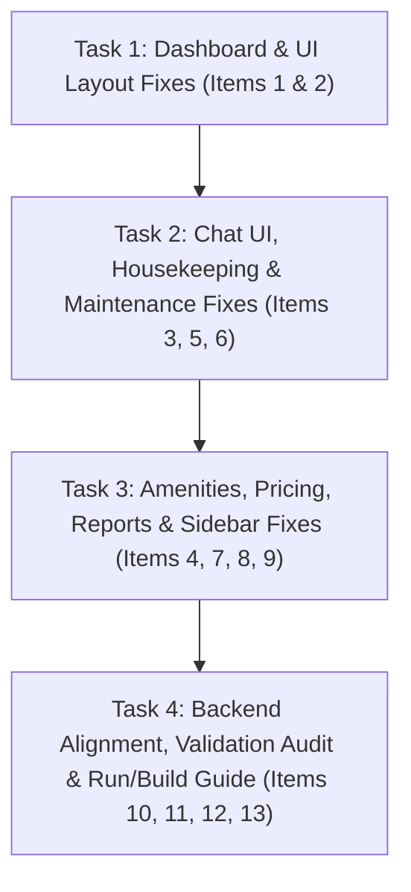

# Phase 2: Bug Fixes, Backend Alignment & System Verification Plan

This plan details the systematic resolution of all 13 issues reported during testing, alignment with `Backend Development Guide.md`, complete UI polish, and full system verification prior to faculty presentation.

---

## 📑 User Reported Issues & Resolution Strategy

### 1. Dashboard Check-In / Check-Out Actions
- **Issue:** Quick action buttons on the Dashboard do not open check-in/check-out modals directly.
- **Fix:** Wire "Process Check In" and "Process Check Out" buttons on `DashboardComponent` to open `CheckInDialogComponent` and `CheckOutDialogComponent` directly or navigate to `/admin/bookings/:id` with action triggers.

### 2. Dashboard Sidebar Extra Whitespace
- **Issue:** Extra white space below the left sidebar when viewing the Dashboard page.
- **Fix:** Adjust CSS height in `AdminLayoutComponent` (`.admin-layout`, `.admin-sidebar`, `.main-content`) to use `min-height: 100vh` and flex layout `align-items: stretch` so the dark sidebar extends continuously to the bottom of the screen regardless of content height.

### 3. Chat UI Cut-Off & Hidden Reply Input Bar
- **Issue:** When multiple chat messages accumulate, the message container pushes the bottom reply bar off-screen.
- **Fix:** Update `ChatInboxComponent` CSS layout:
  - Set `.chat-layout` height to `calc(100vh - 170px)`.
  - Set `.messages-stream` to `flex: 1 1 auto; overflow-y: auto; min-height: 0;`.
  - Set `.reply-bar` to `flex-shrink: 0; position: sticky; bottom: 0; background: #fff; z-index: 10;`.

### 4. Amenities Text Displaying Instead of Icons
- **Issue:** Pre-configured amenities display string names (`wifi`, `tv`, `coffee`, `wind`, `bath`) instead of visual icons.
- **Fix:** Create a centralized `AmenityIconPipe` or helper function mapping icon identifiers to visual emojis:
  - `wifi` ➔ `📶`
  - `tv` ➔ `📺`
  - `coffee` ➔ `☕`
  - `wind` / `ac` ➔ `❄️`
  - `bath` / `jacuzzi` ➔ `🛁`
  - `bar` ➔ `🍸`
  - `pool` ➔ `🏊`
  - Apply this helper across `AmenityManagerComponent`, `RoomTypeFormComponent`, `RoomDetailComponent`, and `BookingDetailComponent`.

### 5. Housekeeping Kanban In-Progress Status Action
- **Issue:** Assigned housekeeping tasks in the Kanban board only show "Assign Housekeeper" or skip to complete.
- **Fix:** Add an explicit "Start Cleaning" button for tasks in `ASSIGNED` or `PENDING` status in `CleaningBoardComponent` to transition tasks to `IN_PROGRESS` status before completing.

### 6. Maintenance Ticket "Room #undefined Not Found" Error
- **Issue:** Submitting a maintenance ticket causes a "Room #undefined not found" error.
- **Fix:** In `MaintenanceFormComponent`, populate a room dropdown from `RoomRepository.getRooms()` or resolve the `roomId` from the entered `roomNumber` string so `roomId` is passed correctly in `createRecord({ roomId, title, description, priority })`.

### 7. Dynamic Pricing Add & Edit Rule Redirect Bug
- **Issue:** Clicking "Add Pricing Rule" or "Edit Rule" redirects to the dashboard home page.
- **Fix:** Update `src/app/app.routes.ts` routes for pricing to include aliases `/admin/pricing/new` and `/admin/pricing/:ruleId/edit`, and update role guard data to allow both `Role.ADMIN` and `Role.MANAGER`.

### 8. Empty Revenue Analytics & Reports Page
- **Issue:** Revenue analytics and export page displays empty states or missing data.
- **Fix:** Align `ReportsComponent` routes in `app.routes.ts` (mapping `/admin/reports` to the unified report component or syncing tabs) and ensure `MockDatabaseService` returns rich mock data for all report types (`RevenueReport`, `OccupancyReport`, `BookingReport`, `ServiceReport`).

### 9. Missing Settings Link in Sidebar Administration Section
- **Issue:** The `ADMINISTRATION` sidebar group is empty and missing the Settings page link.
- **Fix:** Update `AdminSidebarComponent` menu configuration to add `Hotel Settings` (`/admin/settings`) under `ADMINISTRATION`, visible to users with `ADMIN` and `MANAGER` roles.

### 10. Backend API & Schema Alignment
- **Review:** Cross-reference `documentation/Backend Development Guide.md` to ensure domain models (`BookingDetails`, `GuestDetails`, `ServiceRequest`, `RoomDetails`, `PaymentDetails`, `MaintenanceRecord`) and API endpoints match backend specifications.

### 11. Frontend Validation & Interaction Feedback
- **Review:** Audit all reactive forms to ensure strict validation, disabled button states during invalid input/loading, and toast notifications for success/error events.

### 12. Full Code Audit & Bug Sweep
- **Review:** Walk through all 35+ routes and modals to verify zero runtime console errors and smooth user flows.

### 13. Application Run & Build Instructions
- **Documentation:** Provide clear terminal commands to run dev server (`ng serve`) and build the application in both Mock Data mode and API mode.

---

## 🛠️ Task Execution Breakdown

We will execute the work in 4 ordered, manageable tasks:

### **Task 1: Dashboard & UI Layout Fixes (Items 1 & 2)**
- Wire Dashboard check-in and check-out buttons to open modal dialogs.
- Fix sidebar layout height in `AdminLayoutComponent` to remove extra whitespace.

### **Task 2: Chat UI, Housekeeping & Maintenance Fixes (Items 3, 5, 6)**
- Fix Chat Inbox CSS so reply bar stays fixed and visible.
- Add "Start Cleaning" button in Housekeeping Kanban board.
- Fix Maintenance Ticket form to resolve `roomId` correctly.

### **Task 3: Amenities, Pricing, Reports & Sidebar Fixes (Items 4, 7, 8, 9)**
- Implement icon mapper for amenity tags (text ➔ emoji/icon).
- Fix routing paths for Add/Edit Pricing Rules in `app.routes.ts`.
- Ensure Reports page populates mock data and CSV export works seamlessly.
- Add Hotel Settings link to `ADMINISTRATION` sidebar section.

### **Task 4: Backend Alignment, Validation Audit & Run/Build Guide (Items 10, 11, 12, 13)**
- Verify API contract and schema alignment with `Backend Development Guide.md`.
- Audit all form validations and toast notifications.
- Run `ng build` for full production verification.
- Document exact execution and build commands.

---

## 🧪 Verification Plan

### Automated Build Verification
- Execute `cmd /c npm run build` to ensure 0 TypeScript or Angular compiler errors across all routes and components.

### Manual Feature Walkthrough
1. **Dashboard:** Test "Process Check In" and "Process Check Out" dialog triggers. Verify sidebar height on all screen sizes.
2. **Chat Inbox:** Send 5+ messages and verify input reply bar remains visible at the bottom.
3. **Amenities:** Verify amenity tags display emojis instead of raw text.
4. **Housekeeping:** Move task from `PENDING`/`ASSIGNED` ➔ `IN_PROGRESS` ➔ `COMPLETED`.
5. **Maintenance:** Log ticket for Room 101, verify no `undefined` room error.
6. **Pricing:** Click "Add Pricing Rule" and "Edit Rule", verify form opens without redirecting to dashboard.
7. **Reports:** Switch between Revenue and Occupancy tabs, verify data tables load and CSV export downloads `.csv` file.
8. **Settings Sidebar:** Click `ADMINISTRATION` ➔ `Hotel Settings` link in sidebar, verify settings page opens.
