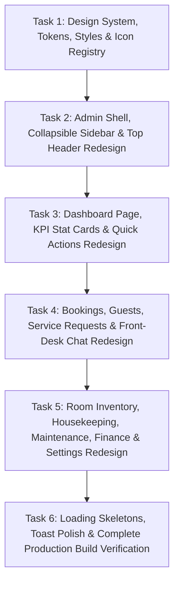

# HMS Admin Panel — UI Redesign & Refinement Plan

This document details the multi-phase execution strategy to transform the **SmartStay Hotel Management System (HMS) Admin Panel** into a **sleek, modern boutique-hotel management dashboard** based on the design tokens, visual guidelines, and component specifications defined in `documentation/design.md`.

---

## 🎨 Core Design Principles & Rules (from `design.md`)

1. **No Emojis as UI Icons:** Every emoji icon across navigation, buttons, badges, tables, and cards will be replaced with clean, professional SVG vector icons from `lucide-angular` / vector icon library.
2. **Typography & Tabular Numbers:** Primary font stack using `Inter` / `Plus Jakarta Sans`, data metrics & currency values using `JetBrains Mono` / `tabular-nums`.
3. **Color Palette:**
   - **Background:** `#F8FAFC` (Slate-50)
   - **Card / Surface:** `#FFFFFF` with subtle borders (`#E2E8F0`) & soft shadows (`0 1px 3px rgba(0,0,0,0.05)`)
   - **Primary Accent:** Slate Navy (`#1E293B` / `#0F172A`)
   - **Luxury Accent:** Warm Amber Gold (`#D97706` / `#F59E0B`)
   - **Operational Statuses:**
     - Occupied: Soft Rose (`bg-rose-50 text-rose-700 border-rose-200`)
     - Available: Soft Emerald (`bg-emerald-50 text-emerald-700 border-emerald-200`)
     - Cleaning: Amber (`bg-amber-50 text-amber-700 border-amber-200`)
     - Reserved: Sky Blue (`bg-sky-50 text-sky-700 border-sky-200`)
     - Maintenance / OOO: Neutral Slate (`bg-slate-100 text-slate-600 border-slate-300`)
4. **Preserve Business Logic:** All underlying Angular services, RxJS streams, signals, route guards, repositories, mock data engines, and form validators remain 100% intact and functional.

---

## 📋 Task Breakdown Roadmap

---

### **Task 1: Design System, Tokens, Global SCSS & Vector Icon Infrastructure**
- **Global SCSS Update (`src/styles.scss`):**
  - Inject CSS custom properties for Slate colors (`--slate-50` to `--slate-900`), luxury gold accents, and operational status palettes.
  - Add typography tokens, border-radius standards (`rounded-lg`, `rounded-xl`), and shadow utilities.
  - Define custom scrollbar styling and form input focus ring tokens (`ring-2 ring-slate-900`).
- **Vector Icon Helper Component (`LucideIconComponent` / SVG Registry):**
  - Create a lightweight, reusable standalone Angular icon component to render vector SVG icons (`layout-dashboard`, `bed-double`, `calendar-days`, `users`, `sparkles`, `receipt`, `trending-up`, `settings`, `log-in`, `log-out`, `search`, `bell`, `plus`, `refresh-cw`, `check`, `x`, `filter`, `clock`, `wrench`, `shield-alert`, `message-square`, `chevron-down`, `chevron-right`).

---

### **Task 2: Admin Shell, Collapsible Sidebar & Top Navigation Header**
- **Sidebar Component (`AdminSidebarComponent`):**
  - Implement collapsible sidebar navigation (`w-64` expanded ➔ `w-20` collapsed) with smooth CSS transitions.
  - Add hotel brand header with property selector dropdown ("SmartStay Grand Hotel & Resort").
  - Update all 7 navigation groups to use vector SVG icons instead of emojis.
  - Active link highlight with solid slate background (`bg-slate-900 text-white shadow-sm`).
  - Add user profile footer with avatar badge, staff name, role badge (`Admin` / `Manager`), and quick logout menu.
- **Header & Breadcrumb Components (`AdminHeaderComponent`, `BreadcrumbComponent`):**
  - Breadcrumb track (`Home / Rooms / Executive Suite 302`).
  - Universal search bar with `Cmd + K` visual hint.
  - Live occupancy pill showing occupancy percentage badge & today's check-ins count badge.
  - Notification bell badge with alert pulse and user profile quick dropdown.

---

### **Task 3: Dashboard Page, KPI Stat Cards & Quick Actions**
- **Dashboard Component (`DashboardComponent` & `MetricCardComponent`):**
  - Redesign 6 KPI cards with trend indicators (`+12.5% vs last week`), vector Lucide icons, and modern slate border cards.
  - Quick Action bar with styled pill buttons & vector icons (`Search`, `LogIn`, `LogOut`, `Kanban`, `MessageSquare`, `Users`).
  - Today's Arrivals, Today's Departures, Urgent Services, and Waiting Chat queue cards with status badges and modern hover states.
  - Remove all emojis and replace with vector icons.

---

### **Task 4: Bookings, Guest Directory, Service Requests & Front-Desk Chat**
- **Bookings (`BookingListComponent`, `BookingDetailComponent`, Dialogs):**
  - Modern filter bar with search input, status pills, and slide-over filter drawer.
  - Data table with subtle header fill (`bg-slate-50`), status badges, door passcode monospace badge (`#FEF3D6`), and action buttons (`Check In`, `Check Out`, `Cancel`).
  - Redesign check-in, checkout, and cancellation dialogs with frosted backdrop.
- **Service Requests & Chat (`ServiceRequestListComponent`, `ServiceRequestBoardComponent`, `ChatInboxComponent`):**
  - CDK Drag & Drop Kanban board with category tags and priority badges.
  - Chat Inbox 2-panel split view with speech bubble stream (`Customer`, `AI Bot`, `Admin Staff`) and sticky reply bar.
  - Replace all emojis with vector icons.

---

### **Task 5: Room Inventory, Housekeeping, Maintenance, Finance & Hotel Settings**
- **Rooms & Room Types (`RoomListComponent`, `RoomFormComponent`, `RoomDetailComponent`, `AmenityManagerComponent`):**
  - Interactive Room Grid Matrix with top status bar (Occupied: Rose, Available: Emerald, Cleaning: Amber, Maintenance: Slate).
  - Amenity manager chip tags with vector icons.
- **Operations (`CleaningListComponent`, `CleaningBoardComponent`, `MaintenanceListComponent`, `MaintenanceFormComponent`):**
  - Housekeeping Kanban board & repair tickets ledger with housekeeper & technician assignment controls.
- **Finance & Analytics (`PaymentListComponent`, `PaymentDetailComponent`, `PricingRulesComponent`, `ReportsComponent`):**
  - Payment ledger, dynamic pricing master engine toggle, revenue metrics, and CSV export.
- **Hotel Settings (`SettingsComponent`):**
  - Refined multi-section settings card (Hotel Profile, Check-in/out rules, Tax rate, Policy text).

---

### **Task 6: UI Micro-Interactions, Skeletons, Toasts & Build Verification**
- Replace standard spinners with animated skeleton loaders (`animate-pulse`).
- Refine `ToastContainerComponent` notifications with modern toast styling.
- Perform `ng build` compilation verification to ensure 0 TypeScript or Angular compiler errors.

---

## 🧪 Verification Plan

### Automated Build Verification
- Execute `cmd /c npm run build` to verify clean compilation across all routes, standalone components, and styles.

### Visual & Functional Testing
- Verify sidebar collapse/expand interaction.
- Check vector icon rendering across navigation, buttons, badges, and headers.
- Verify status colors: Occupied (Rose), Available (Emerald), Cleaning (Amber), Reserved (Sky), Maintenance (Slate).
- Verify dark/light theme contrast and accessibility compliance.
